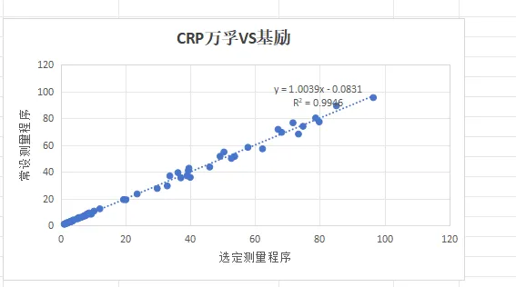
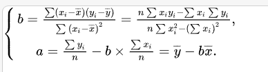
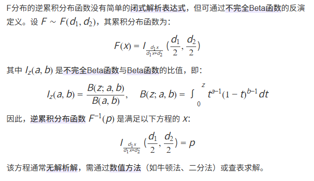

### 背景
1. 经过表格数据录入与计算，需要用图表直观展示。
2. 散点图中添加回归线是数据分析中常用的方法，可以帮助理解变量间的趋势关系。
3. R平方值是回归分析中评估重要指标
### 难点
1. 散点图需要有一条回归线并显示对应的公式`y=Slope*x-Intercept`以及`R平方值`。
2. echart的简单散点图没有这些，需要安装对应插件ecStat
3. 复杂一点的计算特别注意精度问题和边界情况,不用原生的JS运算符`+ - * /`直接计算，在浮点数二进制表示方式，可能会导致计算结果不准确，可读性也低。
### 解决方案
1. 方案一：`ecStat`是`ECharts`官方的统计工具库，是它的扩展插件。支持线性回归、指数回归等。一开始是安装该插件，根据`ecStat.regression('linear', rawData)`得到结果，包含斜率, 截距等情况。
2. 方案二：不用扩展插件，直接计算斜率与截距、R平方值，因为需要自己计算的公式很多。借助 decimal.js实现更加灵活`new Decimal(0.1).plus(0.2).equals(0.3);` 它的精度比较准确，链式调用可读性高，对比于math.js更加轻量
### 实现
1. echart的简单散点图是显示点的坐标，跟饼图、曲线图一样传入数组arr，series数据的type为scatter即可
    - `option = {xAxis: {}, yAxis: {},series: [{type: 'scatter',data:scatterData,symbolSize: 10 }]}`
2. 散点图显示对应回归线那么需要在`series`数据集中多加一个type为line的数据
    - `{ type: 'line',data: lineData,symbol: 'none'}`
3. 计算得到a,b后。 line线的绘制需要知道它的起点终点。x直接取arr的最大最小值，已知最大最小x，y代入公式可得最大最小y。那么回归线即可绘制。
### 坑点
#### 坑点1 公式的精确计算


1. 回归斜率：`calcINTERCEPT(listx, listy) {}` 返回两组数值的斜率、截距值
    - 首先利用decimal这个插件先格式化用户输入的数据，比如去空格、精度问题等，计算前做好数据过滤转变。 
    - 计算x 、y的均值`avgX`、`avgY`，
    - for循环计算`(x-avgX)(y-avgY)`累加、`decimal.pow()`计算`(x-avgX)`平方累加；
    - `multiSum.div(xMinusXAvgPow2Sum).toString()`得到a
2. 线性回归：`calcCORREL(listx, listy){}` 返回两组数值的相关系数
    - 同上格式化，再计算x 、y的均值avgX、avgY；for循环计算`(xi - avgX)(yi - avgY)`累加；`(xi - avgX)`平方累加与`(yi - avgY)`平方累加相乘，最后`decimal.pow(val, 0.5）开方`
```js
/**
 * 一元线性回归斜率、截距值计算
 * @param {Array} listx x轴的值
 * @param {Array} listy y轴的值
 * @returns {String, String} y = ax + b 
 */
static calcINTERCEPT(listx, listy) {
    const xList = listx.filter((i) => i && `${i}`.trim() != '').map(i => `${i}`.trim())
    const yList = listy.filter((i) => i && `${i}`.trim() != '').map(i => `${i}`.trim())
    console.log(xList, yList);
    // 计算公式
    const len = Math.min(xList.length, yList.length)
    const calcxList = xList.slice(0, len)
    const calcyList = yList.slice(0, len)
    const avgX = Rounder.calcAvg(...calcxList)
    const avgY = Rounder.calcAvg(...calcyList)
    let multiSum = decimal(0)
    let xMinusXAvgPow2Sum = decimal(0)
    for (let i = 0; i < len; i++) {
        const x = calcxList[i]
        const y = calcyList[i]
        const xMinusXAvg = decimal(x).minus(avgX)
        const yMinusYAvg = decimal(y).minus(avgY)
        // (x-xAvg)*(y-yAvg)的累加
        const multi = xMinusXAvg.mul(yMinusYAvg)
        multiSum = multiSum.add(multi)
        // (x-xAvg)平方的累加
        const xMinusXAvgPow2 = decimal.pow(xMinusXAvg, 2)
        xMinusXAvgPow2Sum = xMinusXAvgPow2Sum.add(xMinusXAvgPow2)
    }

    const A = multiSum.div(xMinusXAvgPow2Sum).toString();
    const B = decimal(avgY).minus(decimal(A).mul(avgX)).toString();
    console.log("A", A)
    console.log("B", B)
    return { A, B };
}
/**
 * 返回两组数值的相关系数
 * @param {Array} listx x轴的值
 * @param {Array} listy y轴的值
 * @param {number} precision R值的保留小数位
 * @returns {String} 返回向下修约后的r
 */
static calcCORREL(listx, listy) {
    const xList = listx.filter((i) => `${i}`.trim() != '').map(i => `${i}`.trim())
    const yList = listy.filter((i) => `${i}`.trim() != '').map(i => `${i}`.trim())
    // 计算公式
    const len = Math.min(xList.length, yList.length)
    const calcxList = xList.slice(0, len)
    const calcyList = yList.slice(0, len)
    const avgX = Rounder.calcAvg(...calcxList)
    const avgY = Rounder.calcAvg(...calcyList)
    let xMinusXAvgMulyMinusYAvgSum = decimal(0)
    let xMinusXAvgPowSum = decimal(0)
    let yMinusYAvgPowSum = decimal(0)
    for (let i = 0; i < len; i++) {
        const x = calcxList[i]
        const y = calcyList[i]
        const xMinusXAvg = decimal(x).minus(avgX)
        const yMinusYAvg = decimal(y).minus(avgY)
        const xMinusXAvgMulyMinusYAvg = decimal(xMinusXAvg).mul(yMinusYAvg) 
        //(xi - avgX)(yi - avgY)累加
        xMinusXAvgMulyMinusYAvgSum = xMinusXAvgMulyMinusYAvgSum.add(xMinusXAvgMulyMinusYAvg)
        //(xi - avgX)平方累加
        const xMinusXAvgPow = decimal.pow(xMinusXAvg, 2)
        xMinusXAvgPowSum = xMinusXAvgPowSum.add(xMinusXAvgPow)
        //(yi - avgY)平方累加
        const yMinusYAvgPow = decimal.pow(yMinusYAvg, 2)
        yMinusYAvgPowSum = yMinusYAvgPowSum.add(yMinusYAvgPow)
    }
    const step1 = decimal.pow(xMinusXAvgPowSum, 0.5).mul(decimal.pow(yMinusYAvgPowSum, 0.5))
    const R = xMinusXAvgMulyMinusYAvgSum.div(step1).abs().toString()
    return R;
}
```
#### 坑点2 正态分布：F分布的逆累积分布函数，execl的公式 =FINV(0.05,9,20)

1. 可以计算FINV的库`mathjs science.js jStat`
2. 难点：
    - 首先使用线上提供的解决方案是jStat的`const tValue = jStat.f.inv(q, df1, df2)`，但是代入进去是错的;
    - 用mathjs写个dome,计算结果也有问题。
    - 根据公式实现，但是公式复杂符号过多，无法计算
3. 解决：
    - 查看jStat官网，api说明太简单，专业性也强，最后找到了正确的api
    - 返回中心F分布的累积概率密度为p的x的值`const tValue = jStat.centralF.inv(q, df1, df2)`
#### 坑点3 散点图出不来
如果minY为负数会报错,然后整个图像显示为空，解决方式是设置minY为0，获取对应的minX的值
