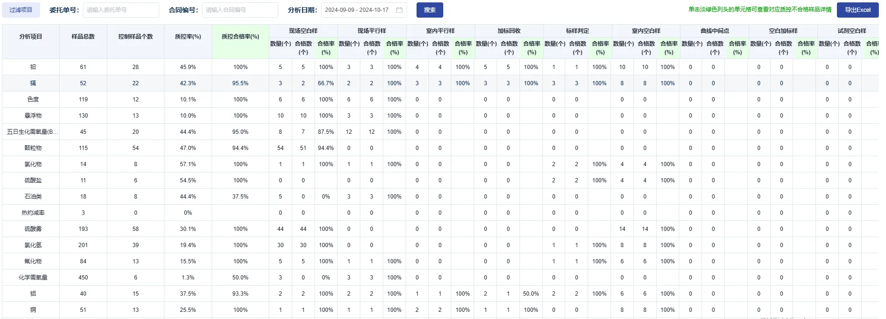
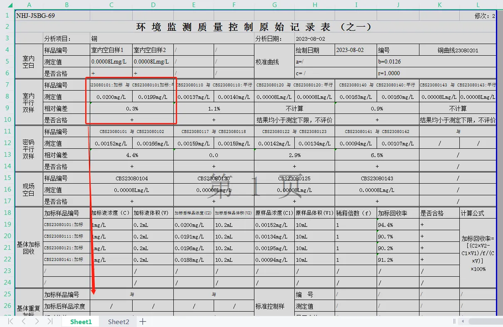

### 场景
1. 系统很多地方都有用到表格导出，并且导出的格式多样化：比如多级表头；
2. 导出数据有多个sheet、样式特别复杂比如表头是纵向配置的等等。

### 解决方案
主要使用`exceljs`插件实现复杂样式、单元格格式控制
### 实现
#### 思路
1. 根据输入的参数`columns`、`tableData`构建为标题数组、合并单元格数组；
2. 创建表格与工作表: `const workbook = new ExcelJS.Workbook();const worksheet = workbook.addWorksheet("Sheet1");`
3. 生成标题，单行表头或多级表头；
4. 添加数据：将tableData使用`sheet.addRows(tableData)`添加进表格；
5. 设置每一列样式：
    - `sheet.getRow`获取具体行
    - `row.eachCell((cell)=>{})`，设置每一格单元格的`cell.border、cell.font`等样式
6. 表格转流: `const buffer = await workbook.xlsx.writeBuffer()`；
7. 下载表格：创建`Blob`对象，创建下载a链接，触发点击事件；
#### 代码实现
1. 多级表头数据格式转化
```js
// {dataIndex: 'score',key: 'score',title: '现场空白样',
//   children: [
//       { width: 80,key: 'english',title: '"数量(个)', },
//       { width: 80,key: 'math',title: '合格数(个)',},
//       {width: 80,key: 'physics',title: '合格率(%)'} ]},
// 转为下面
// tableTitleArr：
// ["分析项目","样品总数","控制样品个数","质控率(%)","质控合格率(%)","现场空白样","","","现场平行样","", "","室内平行样","", "", "加标回收", "","","标样判定", "", "", "室内空白样","", "", "曲线中间点", "", "", "空白加标样", "","","试剂空白样","","","室内稀释样","", ""]
// ["分析项目","样品总数","控制样品个数", "质控率(%)","质控合格率(%)","数量(个)","合格数(个)","合格率(%)","数量(个)","合格数(个)", "合格率(%)","数量(个)","合格数(个)","合格率(%)","数量(个)","合格数(个)","合格率(%)","数量(个)","合格数(个)","合格率(%)","数量(个)","合格数(个)","合格率(%)", "数量(个)","合格数(个)", "合格率(%)","数量(个)", "合格数(个)","合格率(%)","数量(个)", "合格数(个)","合格率(%)","数量(个)","合格数(个)","合格率(%)"]

// titleMerge：
//  [ { "keys": [ "A","A"], "span": 2},{ "keys": [ "B","B"], "span": 2},{ "keys": [ "C","C"], "span": 2},{ "keys": [ "D","D"], "span": 2},{ "keys": [ "E","E"], "span": 2},
// { "keys": [ "F","H"], "span": 3 },{ "keys": [ "I","K"], "span": 3 },{ "keys": [ "L","N"], "span": 3 },...{ "keys": [ "AG","AI"], "span": 3 }]
```
2. 表格实现以及合并的核心
```js
// 合并的核心
// sheet.mergeCells('A3:A4') sheet.mergeCells('F3:H3')
if (tableTitleArr) {
  tableTitleArr.forEach((title, index) => {
    sheet.getRow(start + index).values = title;
  });

  //合并表头
  if (titleMerge && titleMerge.length) {
    for (let m of titleMerge) {
      //格式：{ keys: [起始列, 结束列], span: 要合并格子的长度 } 列是字母，span是数字
      let [startKey, endKey] = m.keys;
      if (startKey === endKey) {
        sheet.mergeCells(
          `${startKey}${start}:${endKey}${start + m.span - 1}`
        );
        console.log( m.keys, `${startKey}${start}:${endKey}${start + m.span - 1}`);
        // 'A3:A4' 'B3:B4' 'C3:C4' 'D3:D4' 'E3:E4' 
      } else {
        sheet.mergeCells(`${startKey}${start}:${endKey}${start}`);
        console.log( m.keys,`${startKey}${start}:${endKey}${start}`);
        // 'F3:H3' 'I3:K3' 'L3:N3' 'O3:Q3'... 'AG3:AI3
      }
    }
  }
}
// 展开显示 正常数组
sheet.columns = tableKey;
// 添加数据
sheet.addRows(tableData);
...
//合并表格
if (contentMerge && contentMerge.length) {
  for (let m of contentMerge) {
    //格式：{ keys: [起始列, 结束列], field: [起始行, 结束行] } 列是字母，行是数字
    let [startKey, endKey] = m.keys;
    let [startField, endField] = m.field;
    sheet.mergeCells(
      `${startKey}${startField + start}:${endKey}${endField + start}`
    );
  }
}
```
### 难点场景实现

#### 场景：
样式特别复杂比如表头是纵向配置，需要直接拿到模板，读取模板内容并且控制每一格的值
#### 实现
1. 读取模板文件，获取格式内容,`await sourceWorkbook.xlsx.readFile(templatePath);sourceSheetOne = sourceWorkbook.getWorksheet(1); `
2. 根据模板新建一个带格式的sheet，`const sourceSheet = lodash.cloneDeep(sourceSheetOne);`
3. 设置每一种样品的开始位置，根据位置设置对应的值`sheet.getCell('C3').value = ...`
4. 根据模板生成表格，可能会转码问题，生成失去样式的文件。