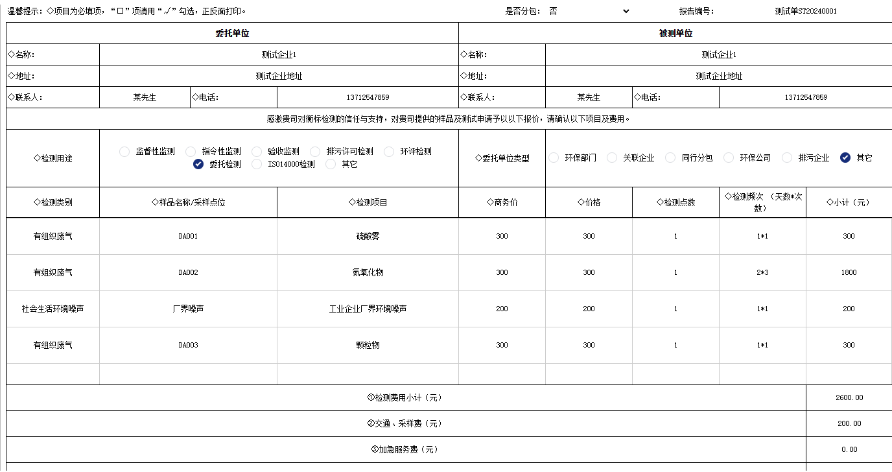

### 场景
1. 系统下达任务流程或者录入报价单时候，需要填很多信息。
2. 报价单、任务单、分析单等表单希望跟填纸质单一样，直接在上面选填这次实验的委托信息、实验数据。
### 难点
1. 它的单元格就有多种形式。
2. 如点击单元格出现下拉框展示计算单位、日期或者弹出弹窗选择公司、检测项目、检测方法、人员等。
3. 这种选择可以减少错误率，比手写快速。
### 解决方案
1. 用了内部插件`fx-websheet`，是类`Excel`的自定义表单组件。它可以像`execl`一样有必填项校验、设置下拉框内容、复制粘贴。
2. 它是通过在线`Excel`来设计表单布局以及边线样式后导出一个模板`json`，利用自定义组件`fx-websheet-widget`渲染对应位置的json模板来完成表单录入功能的一个产品.
### 实现

1. 配置表单的json文件
    - 设置`rowHeight`每一行高度、`colWidth`单元格宽度、`spans`合并单元格等配置
    - 配置表单的`data`，包含了`form`布局，`table`布局
    - 它们根据`bind`字段绑定具体某个单元格如C1的`field`存放数据变量，`type`设置单元格类型；`"bind":{ "C1": {"field": "projectData","type": "dateTime","style":{}}}`
```js
{
    "title": "表单标题",
    "cells": {},
    "colWidth": {},
    "rowHeight": {},
    "spans": [],
    "data": [{
        "entity": "$data.form",      // Form区域
        "layout": "form",
        "bind": {
            "B3": {                      // 指明单元格位置
                "field": "",             // 绑定字段
                "type": "",              // 类型
                "tag": "",               // 标记
                "formula": "",           // 公式
                "alias": "",             // 别名
                "expression" : "@table.Count*@table.t_price || ''"//自动计算结果
                "validation": {          // 校验规则
                    "regex": "",         // 正则表达式
                    "tip": ""            // 错误提示
                }         
            },
        }
  }]
}  
```
2. 配置各种类型的单元格
    - 单元格的type有很多内置类型，比如`string、date、number、select、image、autocomplete`，下拉选项需要`option`数组；
    - 录入数据后结果列自动计算结果，在具体单元格如C5设置公式，增加`expression`对象。比如：单价与数据相乘为`"expression" : "@table.Count*@table.t_price || ''"`
    - 校验数据的重复性：比如`名字、标准号`填写或复制进去后，单元格会拿到文本，然后跟全部数据对比，如果存在则单元格右上标红，表示校验不通过。
    - select多级联动：选择`气的类型`，后面`子类型就只能出现空气、废气`等选项。根据其他select单元格字段值决定当前的下拉选项
3. json配置文件如何转为表单页面，编辑并保存数据
    - 使用内部组件`fx-websheet-widget`，组件传递表单名称，表单数据集合
    - `<fx-websheet-widget :class="{'taskLaunchForm': readonly }" v-if="CoopID" :ReadOnly="readonly" :key="key" Type="customForms" Name="taskLaunch" ref="sheet" :Hooks="hooks"  @datachange="ondatachange"></fx-websheet-widget>`
    - 组件内部会根据表单名称`taskLaunch`去`websheetforms`文件夹拿到表单模板的`json`文件，结合数据生成表单
    - 保存数据：修改后，通过调用内部接口获取结构、数据，发送请求保存到数据库
### 其他
1. `fx-websheet-widget`如何实现？
    - ①初始化init，获取配置目录下的form文件，根据`:Tpl="templateObj"`开始根据模板`templateObj`加载
    - ②定义当前模板内所有自定义单元格开始加载自定义`webcomponent`
    - ③加载初始化数据；
    - ④生成表单; 
2. 人员、仪器、企业等管理模块以及数据初始化的批量导入也使用自定义表单
    - 原本实现是通过上传execl表格，读取文件内容并构建数据对象，发送请求保存实现的。
    - 有些数据是一些国家标准名称一般不可修改，整个流程都会使用，导入重复或有问题的数据后面生成的报告很难修改。
    - 所以需要数据格式化、必填项、严格的校验与重复性检查。需要设置自定义单元格
    