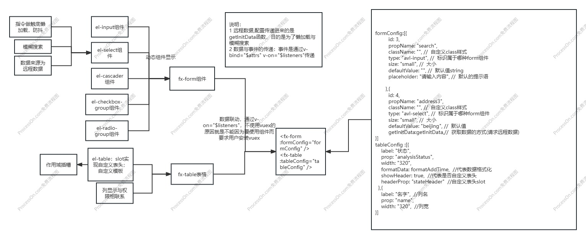

### 场景
1. 资源管理、数据统计都需要用到比如车辆管理、仪器管理等管理模块，维护数据、出入库数据一般都是表格显示，并且配套一些条件过滤与分页
2. 封装一个`form`组件，有`input select timerange`等搜索条件。下面是`table`组件，表格内容可以根据form组件传入的条件等变化
### 解决方案
1. 实现主要是对`elementui`的常用组件的二次封装。
2. form组件包含了elementui的`input select timerange radio`组件，根据传入的配置显示组件用了动态组件。
3. table组件的多级表头、表头和表格内容区域都可以进行自定义是用了递归以及插槽，根据传入的配置显示表格。
### 实现
1.  数据结构`formConfig tableConfig`如何设计？
2. `fx_form`组件需要先定义`fx_input fx_select fx_timerange fx_radio`几个通用组件，然后定义`fx_form`文件
    - 在里面props接收传入的配置数组以及`v-for`遍历，`<component :is="type">`根据通过:is属性动态切换渲染哪个需要的子组件。
3. `fx_table`组件，多级表头且可以自定义标题，需要定义`columnItem`子组件
    - 多级表头：表格列组件需要进行递归，所以这里主要解决了`递归+插槽嵌套`的问题。如果传入的列数组有`children`说明有下一级数据，则递归使用自己，生成多级表头
    - 表头和表格内容自定义：通过列的`slotName headerProp`配置
    - 页码封装、数据请求：通过传入的动态配置项(查询参数)以及请求接口去请求；watch会观察到查询参数变化就重新请求
4. `form组件`的输入框进行搜索如何影响`table内容`显示
    - 页码变化或者fx_form一些表单查询条件的变化一般作用在动态配置项上，检测到变化了就重新请求

```js
// formConfig 根据传入的配置显示组件用了动态组件
formConfig = [{
    propName,
    type: 'fx-input',
    size,
    defaultValue,
    clearable,
    },{
    propName,
    type: 'fx-select',
    size,
    clearable,
    multiple,
    loadmore: true,
    defaultValue,
    filterable,
    getInitData() {}//写接口       
}]
// tableConfig 根据传入的配置显示表格，有children说明是多级表单
tableConfig =  {
  border: false, // 表格样式配置
  columns: [     //自定义列 是一个数组
    { prop: "ID",label: "ID",width: "120",},
    { prop: "Name",label:"名字",width: "320", slotName: 'MethodName', headerProp: "stateHeader" },  //自定义表头slot值,
    { prop: 'title',label: '书名',
      children: [{prop: 'author', label: '作者'} ,{prop: 'readCount', label: '阅读数'}]
    }],
}
```
### 难点
1. 有些组件交互复杂，甚至由多个子组件构成，它们之间的通信和状态共享如何处理？
    - 多级组件嵌套需要传递数据时，通常使用的方法是通过vuex。如果仅仅是传递数据，而不做中间处理，使用 vuex 处理，这就有点大材小用了
        - 解决：使用`$attrs/$listeners`;数据与事件的传递：数据是通过`v-bind="$attrs"`，事件是通过`v-on="$listeners"`传递。
    - 数据处理：业务组件-> fx-form组件->子组件，数据属性如何显示得到具体input\select上？
        - 解决：孙到子如何传递，就是`中间fx_form`的动态组件`v-bind="item"`属性继承业务组件传过来的配置属性;孙子组件据是通过`v-bind="$attrs"`，继承原有组件所有的v-bind属性
    - 事件处理：如孙子组件select变化，搜索框变化，点击搜索等等，事件如何传递给上级组件？
        - 解决：使用事件`$listeners"`透传给最外层的业务组件。fx_form的动态组件`v-on="$listeners"`继承业务组件所有v-on的事件，fx_form的子组件如fx-input触发自定义事件时候，业务组件的fx_form可以感应得到数据变化然后通知给fx_table了
2. fx_form组件的子组件`el-select`组件可以远程数据，并且触底懒加载。主要是使用指令实现
    - 很多select数据并不是固定死的，而是需要接口获取的。业务组件可以配置`getInitData`方法,具体fx-select组件调用传递过来的远程搜索方法，拿到对应的选项值
    - 有些数据比较多，为了显示不卡顿，那么需要触底懒加载。主要使用指令去封装`v-select-loadmore="debounce(loadMore)"`
3. fx_table组件表头和表格内容区域都可以进行自定义，就是需要用到插槽。多层级的插槽还会涉及到透传
    - 具体页面为父页面，表格组件为子页面，表格列组件`TableColumn`为孙子组件，在父页面中使用了插槽，并且插槽放置了内容，在孙子组件中是获取不到的。
    -  所以需要用到作用域插槽`$scopedSlots`透传。让TableColumn可以获取到具体页面传递的插槽内容。