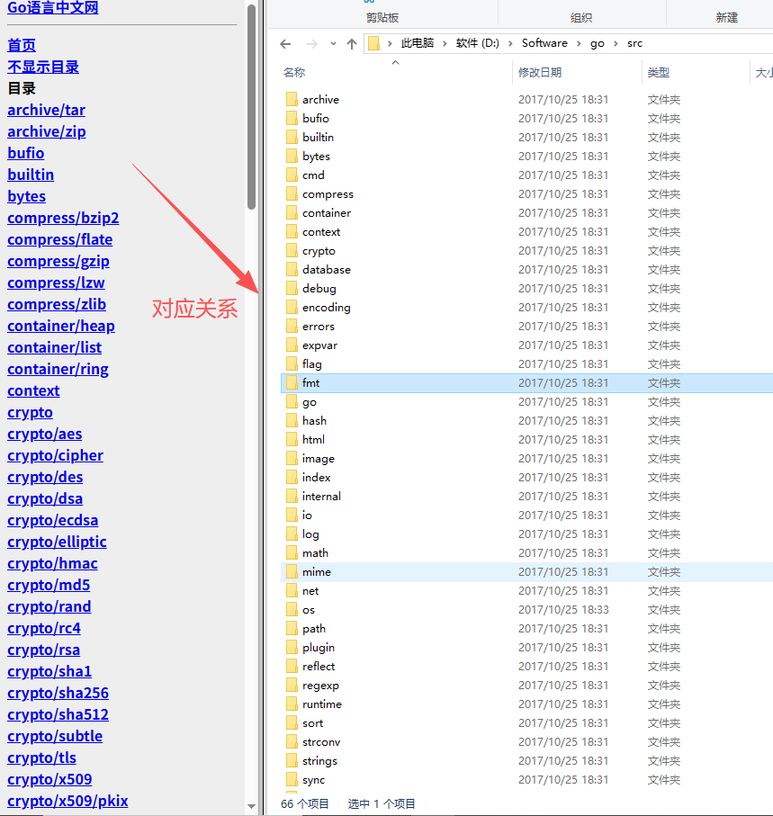
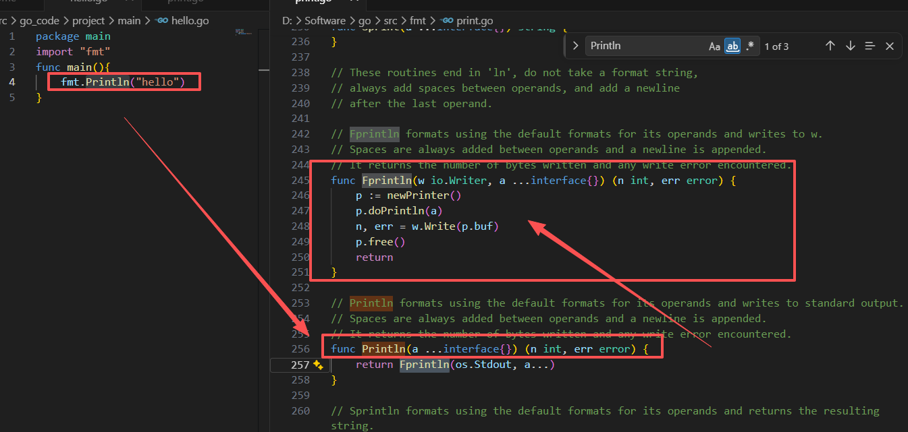

## 介绍使用
### 特点
1. Go语言保证了既能到达静态编译语言的安全和性能，又达到了动态语言开发维护的高效率。从C语言中继承了很多理念，包括表达式语法，控制结构，基础数据类型，调用参数传值，指针等
2. 引入包的概念，用于组织程序结构，Go语言的一个文件都要归属于一个包，而不能单独存在
3. 垃圾回收机制，内存自动回收，不需开发人员管理
4. 管道通信机制，形成Go语言特有的管道channel,通过管道channel可以实现不同的goroutine之间的相互通信
5. 天然并发
6. 有新语法：比如切片 slice、延时执行 defer
7. 极简单的部署方式：可直接编译成机器码、不依赖其他库、直接运行即可部署
### 应用场景
1. 区块链技术
2. 后台服务器应用：负载均衡，cache，容错
3. 云服务后台应用：CDN的调度系统、分发系统
### 安装
1. 安装`visual studio code`
2. 下载golang对应版本的安装包 `https://golang.google.cn/dl/`
3. windows 下配置 Golang 环境变量
    - `GOROOT`：指定SDK的安装路径如 `d:/programs/go`
    - `Path`：添加SDK的/bin目录
    - `GOPATH`：工作目录，go项目的工作路径
4. 配置好，在终端输入`go version`，会打印出对应的版本号
5. 使用语法api：`https://studygolang.com/pkgdoc`
### 源码阅读
1. src目录是重要源码，里面有很多包，import引用的包在里面，阅读源码直接查看这个就好，与中文网的api是一一对应关系。


## 语法
### main函数
1. 新建.go文件，然后编写如下。
2. 执行：
    - 第一种：`go run xx` 表示直接编译go语言并执行应用程序；
    - 第二种：`go build` 命令对该go文件进行编译，生成.exe文件，运行xx.exe文件即可
```go
// package main定义了包名。必须在源文件中非注释的第一行指明这个文件属于哪个包
// package main表示一个可独立执行的程序，每个 Go 应用程序都包含一个名为 main 的包
package main
// 告诉 Go 编译器这个程序需要使用 fmt 包, 包实现了格式化 IO（输入/输出）的函数。
import "fmt"
// func 是一个关键字，表示一个函数。
// main 是函数名，是一个主函数，即我们程序的入口。
func main() {
    // 表示调用 fmt 包的函数 Println 
    fmt.Println("Hello Go")
}
```
### 变量声明
1. 局部变量的声明
    - var a int 声明一个变量 默认的值是0
    - var b int = 100  声明一个变量，初始化一个值
    - var c=100 可以省去数据类型，通过值自动匹配当前的变量的数据类型
    - e:= 100 省去var关键字，直接自动匹配，但是不支持全局
2. 多变量的声明
    - var xx,yy int = 100,200 单行写法
    - 多行写法
```go
package main
import "fmt"
func main() {
	//方法一：声明一个变量 默认的值是0
	var a int
	fmt.Println("a = ", a)  //a =  0
	fmt.Printf("type of a = %T\n", a)//type of a = int
	//方法二：声明一个变量，初始化一个值
	var b int = 100
	fmt.Println("b = ", b)  //b =  100
	fmt.Printf("type of b = %T\n", b)//type of b = int
  //方法三：可以省去数据类型，通过值自动匹配当前的变量的数据类型
	var c = 100
	fmt.Println("c = ", c) //c =  100
	fmt.Printf("type of c = %T\n", c)//type of c = int
  //方法四：(常用的方法) 省去var关键字，直接自动匹配
	e := 100
	fmt.Println("e = ", e) //c =  100
	fmt.Printf("type of e = %T\n", e)//type of e = int 

  // 声明多个变量
	var xx, yy int = 100, 200
	fmt.Println("xx = ", xx, ", yy = ", yy) // xx =  100 , yy =  200
  //多行的多变量声明
	var (
		vv int  = 100
		jj bool = true
	)
	fmt.Println("vv = ", vv, ", jj = ", jj) // vv =  100 , jj =  true 
}
```
### 常量
1. 常量 const a int = 10
2. iota 与const来表示枚举类型
```go
package main
import "fmt"
const (
	//可以在const() 添加一个关键字 iota， 每行的iota都会累加1, 第一行的iota的默认值是0
	a = 10*iota	 //iota = 0
	b 		       //iota = 1
	c            //iota = 2
)
func main(){
	//常量(只读属性)
	const length int = 10
	fmt.Println("length = ", length) // length =  10
	//length = 100 //常量是不允许修改的。
	fmt.Println("a = ", a) // a =  0 
	fmt.Println("b = ", b) // b =  10
	fmt.Println("c = ", c) // c =  20
}
```
### string
1. 对于字符串 操作的 4 个包：bytes、strings、strconv、unicode
2. bytes包：操作[]byte。因为字符串是只读的，因此逐步构创建字符串会导致很多分配和复制，使用 bytes.Buffer 类型会更高。
3. strings包：提供切割、索引、前缀、查找、替换 等功能。
4. strconv包：提供布尔型、整型数、浮点数 和对应字符串的相互转换，还提供了双引号转义相关的转换。
5. unicode包：提供了IsDigit、IsLetter、IsUpper、IsLower 等类似功能，用于给字符分类。
```go
package main
import "fmt"

func main(){
	str := "你好啊！"
	// 如果包含汉字，以下遍历方式会出现乱码：ä½ å¥½åï¼
	for i := 0; i < len(str); i++ {
		fmt.Printf("%c", str[i])
	}
	// 使用 range 来遍历，就不会
	for index, value := range str {
		fmt.Printf("index = %d value = %c\n", index, value)
	}
	// index = 0 value = 你
	// index = 3 value = 好
	// index = 6 value = 啊
	// index = 9 value = ！
}
```
### 函数
1. 返回多个返回值
2. import导包
    - `import _ "fmt"` ：给fmt包起一个别名匿名，无法使用当前包的方法，但是会执行当前的包内部的init()方法
    - `import aa "fmt"`：给fmt包起一个别名aa， aa.Printn()来直接调用。
    - `import . "fmt"`：将当前fmt包中的全部方法，导入到当前本包的作用中，fmt包中的全部的方法可以直接使用API来调用，不需要fmt.APl来调用
```go
package main
import "fmt"
//返回一个返回值
func foo1(a string, b int) int {
	return 100
}
//返回多个返回值， 有形参名称的
func foo3(a string, b int) (r1 int, r2 int) {
	fmt.Println("a = ", a) //a =  foo3
	fmt.Println("b = ", b) //b =  333
	//r1 r2 属于foo3的形参，初始化默认的值是0
	//给有名称的返回值变量赋值
	r1 = 1000
	r2 = 2000
	return
}
func main(){
	c := foo1("foo1", 555)
	fmt.Println("c = ", c)  //c =  100

	ret1, ret2 := foo3("foo3", 333)
	fmt.Println("ret1 = ", ret1, " ret2 = ", ret2)//ret1 =  1000  ret2 =  2000
}
```
### 指针
1. 获取变量的地址，用&，比如:var num int,获取 num 的地址:&num
2. 变量作为参数传入函数，如果原本的变量值要有变化，那么需要
    - 使用指针`swap(&c, &d)`，传入的是变量的地址。
    - 函数的参数需要加上*，`func swap(pa *int, pb *int) {...}`
```go
package main
import "fmt"
func swapValue(a int ,b int) {
	var temp int
	temp = a
	a = b
	b = temp
}
func swap(pa *int, pb *int) {
	var temp int
	temp = *pa //temp = main::a
	*pa = *pb  // main::a = main::b
	*pb = temp // main::b = temp
}

func main(){
	var a int = 10
	var b int = 20
	var c int = 30
	var d int = 40
	swapValue(a, b) 
	swap(&c, &d) 
	fmt.Println("a = ", a, " b = ", b) //a =  10  b =  20 传入值main里面的无变化
	fmt.Println("c = ", c, " d = ", d) // c =  40  d =  30 传入指针则main里面交换了
}
```
### defer
1. defer的执行顺序：defer关键字的语句，先进后出
2. defer和return谁先谁后：return之后的语句先执行，defer后的语句后执行
```go
package main
import "fmt"
func main(){
	//写入defer关键字
	defer fmt.Println("main end1")
	defer fmt.Println("main end2")
	fmt.Println("main::hello go 1")
	fmt.Println("main::hello go 2")
}
//main::hello go 1
//main::hello go 2
//main end2
//main end1
```
### slice
1. 默认都是采用值传递，但是有些值天生就是指针：`slice、map、channel`。
2. 定长数组：写法一：`var myArray1 [3]int` ；写法二：`myArray2 := [5]int{1,2,3}`
3. 动态数组：写法一： `myArray := []int{1,2,3,4}` ；写法二：`slice1 := make([]int, 3)`
4. slice定长数组是值传递，slice 是指针传递。
5. slice 操作：	
    - 截取是浅拷贝：`numbers := []int{0,1,2,3}`  `numbers[1:3]`
    - append()：增加切片的容量  `numbers = append(numbers, 1)`
    - copy()：深拷贝需要使用
```go
func main(){
	// 固定长度的数组 两种写法
	var myArray1 [3]int //写法一
	myArray2 := [5]int{1,2,3}//写法二
  // 遍历两种写法
	for i := 0; i < len(myArray1); i++ {
		fmt.Println(myArray1[i])	
	}
	for index, value := range myArray2 {
		fmt.Println("index = ", index, ", value = ", value)
	}
}
// 0
// 0
// 0
// index =  0 , value =  1
// index =  1 , value =  2
// index =  2 , value =  3
// index =  3 , value =  0
// index =  4 , value =  0
```
```go
package main
import "fmt"
func printArray(myArray []int) {
	//引用传递
	// _ 表示匿名的变量
	for _, value := range myArray {
		fmt.Println("value = ", value)
		myArray[0] = 100
	}
}
func main(){
	// 动态数组，两种写法
	myArray := []int{1,2,3,4} //写法一
	// 声明slice1是一个切片，同时给slice分配空间，3个空间，初始化值是0, 通过:=推导出slice是一个切片
	slice1 := make([]int, 3) //写法二
	// 动态数组是指针传递,在函数里面修改的值，main会改变
	printArray(myArray)
	fmt.Println("修改后遍历-----")
	for _, value := range myArray {
		fmt.Println("value = ", value)
	}	
}
// value =  1
// value =  2
// value =  3
// value =  4
// 修改后遍历-----
// value =  100
// value =  2
// value =  3
// value =  4
```
### map
1. map和slice类似，只不过是数据结构不同，map有三种声明方式
```go
package main
import "fmt"
func main(){
	//声明myMap1是一种map类型 key是string， value是string
	var myMap1 map[string]string
	//在使用map前， 需要先用make给map分配数据空间
	myMap1 = make(map[string]string, 10)
	myMap1["one"] = "java"
	myMap1["two"] = "c++"
	myMap1["three"] = "python"
	fmt.Println(myMap1) //map[one:java two:c++ three:python]

	//===> 第二种声明方式
	myMap2 := make(map[int]string)
	myMap2[1] = "java"
	myMap2[2] = "c++"
	myMap2[3] = "python"
	fmt.Println(myMap2) //map[1:java 2:c++ 3:python]

	//===> 第三种声明方式
	myMap3 := map[string]string{
		"one":   "php",
		"two":   "c++",
		"three": "python",
	}
	fmt.Println(myMap3) //map[one:php two:c++ three:python]
}
```
2. 使用方式
```go
package main
import "fmt"
func printMap(myMap map[string]string) {
	//myMap 是一个引用传递
	for key, value := range myMap {
		fmt.Println("key = ", key, "value = ", value)
	}
}
func main(){
	myMap := make(map[string]string)
	//添加
	myMap["1"] = "java"
	myMap["2"] = "c++"
	myMap["3"] = "python"
	//遍历
	printMap(myMap)
	//删除
	delete(myMap, "1")
	//修改
	myMap["3"] = "C#"
	fmt.Println("遍历查看是否修改-------")
	//遍历查看是否修改
	printMap(myMap)
}
//key =  1 value =  java
//key =  2 value =  c++
//key =  3 value =  python
//遍历查看是否修改-------
//key =  2 value =  c++
//key =  3 value =  C#
```
### 面向对象
1. type、struct:利用 type 可以声明某个类型的别名,声明一种新的数据类型，struct定义一个结构体
2. 封装：Golang 中，类名、属性名、⽅法名 首字⺟大写 表示对外（其他包）可以访问，否则只能够在本包内访问。
3. 继承：父类、子类；子类可以继承父类方法，也可以重写父类同名方法
4. 多态：父类有接口，子类实现父类全部接口方法，父类类型的变量（指针）指向（引用）子类的具体数据变量
```go
package main
import "fmt"
//声明一种行的数据类型Book
//定义一个结构体
type Book struct {
	title string
	auth  string
}
func main(){
	var book1 Book
	book1.title = "Golang"
	book1.auth = "zhang3"
	fmt.Printf("%v\n", book1) //{Golang zhang3}
}
```
继承例子
```go
package main
import "fmt"
// 父类相关
type Human struct {
	name string
	sex  string
}
func (this *Human) Eat() {
	fmt.Println("Human.Eat()...")
}
func (this *Human) Walk() {
	fmt.Println("Human.Walk()...")
}

//SuperMan类继承了Human类的方法
type SuperMan struct {
	Human 
	level int
}
//重定义父类的方法Eat()
func (this *SuperMan) Eat() {
	fmt.Println("SuperMan.Eat()...")
}
//子类的新方法
func (this *SuperMan) Fly() {
	fmt.Println("SuperMan.Fly()...")
}

func (this *SuperMan) Print() {
	fmt.Println("name = ", this.name)
	fmt.Println("sex = ", this.sex)
	fmt.Println("level = ", this.level)
}
func main(){
	h := Human{"zhang3", "female"}
	h.Walk()
	h.Eat()
	//定义一个子类对象
	s := SuperMan{Human{"li4", "female"}, 88}
	fmt.Println("----子类对象")
	s.Walk() //父类的方法
	s.Eat()  //子类的方法
	s.Fly()  //子类的方法
	s.Print()
}
//  Human.Walk()...
//  Human.Eat()...
//  ----子类对象
//  Human.Walk()...
//  SuperMan.Eat()...
//  SuperMan.Fly()...
//  name =  li4
//  sex =  female
//  level =  88
```
多态例子
```go
package main
import "fmt"
//本质是一个指针
type AnimalIF interface {
	Type()
	GetColor() string //获取动物的颜色
	GetType() string  //获取动物的种类
}

//具体的类
type Cat struct {
	color string //猫的颜色
}
func (this *Cat) Type() {
	fmt.Println("Cat is 猫类")
}
func (this *Cat) GetColor() string {
	return this.color
}
func (this *Cat) GetType() string {
	return "Cat"
}

//具体的类
type Dog struct {
	color string
}
func (this *Dog) Type() {
	fmt.Println("Dog is 犬类")
}
func (this *Dog) GetColor() string {
	return this.color
}
func (this *Dog) GetType() string {
	return "Dog"
}

func showAnimal(animal AnimalIF) {
	fmt.Println("color = ", animal.GetColor())
	fmt.Println("kind = ", animal.GetType())
}
func main() {
	var animal AnimalIF //接口的数据类型， 父类指针
	animal = &Cat{"Green"}
	animal.Type() //Cat is 猫类 调用的就是Cat的Type()方法 , 多态的现象
	animal = &Dog{"Yellow"}
	animal.Type() //Dog is 犬类 调用的就是Cat的Type()方法 , 多态的现象

	cat := Cat{"Green"}
	dog := Dog{"Yellow"}

	showAnimal(&cat) // color =  Green kind =  Cat
	showAnimal(&dog) // color =  Yellow kind =  Dog
}

```

### interface与类型断言
1. interface{}是万能数据类型，
2. 如何区分此时引用的底层数据类型到底是什么？--“类型断言” 的机制
```go
package main
import "fmt"
//interface{}是万能数据类型
func myFunc(arg interface{}) {
	//interface{} 改如何区分 此时引用的底层数据类型到底是什么？
	//给 interface{} 提供 “类型断言” 的机制
	value, ok := arg.(string)
	if !ok {
		fmt.Println(arg, ": arg is not string type")
	} else {
		fmt.Println(arg, ": arg is string type, value = ", value)
	}
}
type Book struct {
	auth string
}
func main() {
	book := Book{"Golang"} 
	myFunc(book) // book类型  {Golang} : arg is not string type
	myFunc(100) // int类型   100 : arg is not string type
	myFunc("abc")// string类型  abc : arg is string type, value =  abc
}

```
### 反射
reflect包：valueOf用来获取输入参数接口中的数据的值，如果接口为空则返回0；TypeOf用来动态获取输入参数接口中的值的类型，如果接口为空则返回nil；
```go
package main
import (
	"fmt"
	"reflect"
)
type User struct {
	Id   int
	Name string
	Age  int
}
func (this User) Call() {
	fmt.Println("user is called ..")
	fmt.Printf("%v\n", this)
}
func main() {
	user := User{1, "Aceld", 18}
	DoFiledAndMethod(user)
}
func DoFiledAndMethod(input interface{}) {
	//获取input的type
	inputType := reflect.TypeOf(input)
	fmt.Println("inputType is :", inputType.Name())  //inputType is : User

	//获取input的value
	inputValue := reflect.ValueOf(input)
	fmt.Println("inputValue is:", inputValue) //inputValue is: {1 Aceld 18}
}
```
## 并发编程
### goroutine
1. 协程：goroutine是Go语言并行设计的核心，它比线程更小，执行goroutine只需极少的栈内存，所以可同时运行成千上万个并发任务，goroutine比thread更易用、更高效、更轻便。
2. 创建Goroutine，在函数调⽤语句前添加 go 关键字，就可创建并发执⾏单元。
3. 调用`runtime.Goexit()`将立即终止当前`goroutine`执⾏
```go
package main
import (
"fmt"
"runtime"
)
func main() {
    go func() {
        defer fmt.Println("A.defer")
        func() {
            defer fmt.Println("B.defer")
            runtime.Goexit() // 终止当前 goroutine, import "runtime"
            fmt.Println("B") // 不会执行
        }()
        fmt.Println("A") // 不会执行
    }()  
}
// B.defer
// A.defer
```
### channel
1. channel是Go语言中的一个核心类型，可以把它看成管道。
2. channel是一个数据类型，主要用来解决go程的同步问题以及go程之间数据共享（数据传递）的问题。
3. 定义channel变量：需要一个对应make创建的底层数据结构的引用，
    - chan是创建channel所需使用的关键字`make(chan Type)` 
    - 发送value到channel:`channel <- value`
    - 从channel中接收数据，并赋值给x:`x :=<-channel`
```go
package main
import "fmt"
func main() {
	// 定义一个channel
	c := make(chan int)

	go func() {
		defer fmt.Println("goroutine 结束")
		fmt.Println("goroutine 正在运行")
		c <- 666 // 将666发送给c
	}()

	num := <-c // 从c中接受数据, 并赋值给num
	fmt.Println("num = ", num)
	fmt.Println("main goroutine 结束...")
}
// goroutine 正在运行
// goroutine 结束
// num =  666
// main goroutine 结束...
```
